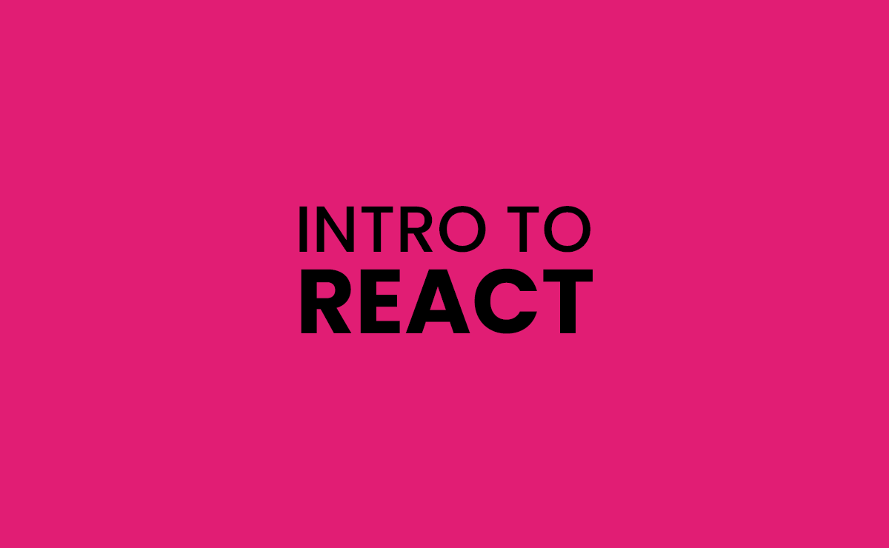

<hr>

This repository contains the starter files and final project files for the Intro To React article published by me on [Dev.to]() and Personal Blog(https://blog.ishandeveloper.com)

Built in <b>React.js</b> with ❤️

#### View Live Demo

  <pre><center><a href="http://devcards.ishandeveloper.com/"><b>devcards.ishandeveloper.com</b></a></center></pre>

## Setup

##### Clone the repository

```bash
git clone https://github.com/ishandeveloper/Intro-To-React.git
```

##### Move to the desired folder

```bash
cd \Intro-To-React
```

##### To install the dependencies, simply write

```bash
npm install
```

##### To run the app, simply write

```bash
npm start
```

## Learn More

You can learn more in the [Create React App documentation](https://facebook.github.io/create-react-app/docs/getting-started).

##### Made with ♥ by <a href="https://github.com/ishandeveloper">ishandeveloper</a>

[](https://github.com/ishandeveloper)
